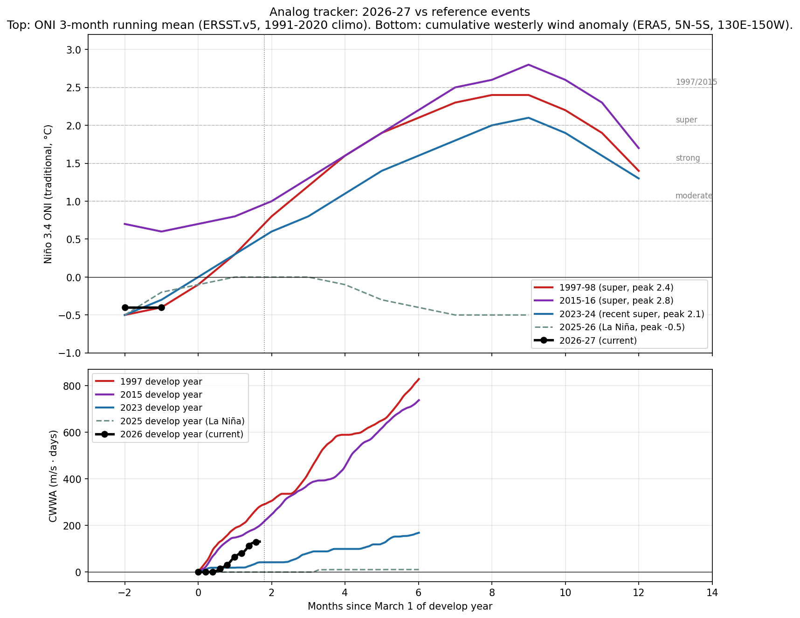

# El Niño Probability Tracker, week of 2026-04-25

Internal use. V1 first batch run.

Target peak season: **DJF 2026-27**. CPC's longest-lead strength bin is NDJ 2026-27, used as the proxy for the DJF peak.

## 1. Headline probabilities

Peak Niño 3.4 (traditional ONI), DJF 2026-27 / NDJ 2026-27.
V1 first batch has one quantitative source for strength bins (NOAA CPC). Numbers below are CPC-derived after translating from RONI to traditional ONI using a flat +0.3°C offset (revisit each issue).

- **At least moderate (>+1.0°C peak)**: 86%
- **Strong (>+1.5°C peak)**: 67%
- **Very strong / super (>+2.0°C peak)**: 41%
- **1997/2015 magnitude (>+2.5°C peak)**: 20% (range 12-21%, see caveat)

**Source-by-source check (qualitative where strength bins aren't broken out):**

- NOAA CPC strength table, NDJ 2026-27 (RONI): super 25%, strong 26%, moderate 26%, weak El Niño 15%, neutral 8%, La Niña 0%. Issued 2026-04-09.
- IRI plume, DJF 2026-27: El Niño 90%, neutral 10%, La Niña 0%. Issued 2026-04-16. Strength not broken out in the public Quick Look.
- BoM ENSO Outlook, issued 2026-04-14: Increased chance of El Niño later in 2026. Categorical only.
- ECMWF SEAS5, run 2026-04-05: Median ensemble path crosses traditional Niño 3.4 +2.0°C by autumn. Roughly 50% of members exceed +2.5°C for October. Implies meaningfully higher upper-tail probabilities than the CPC RONI strength table for the NDJ peak.

**Caveats this issue:**

1. The +2.5°C bucket range is wider than the others because CPC's table doesn't separate >+2.5 from >+2.0 RONI; the 12-21% reflects how much of the open `>=+2.0` RONI bin sits above +2.5°C trad ONI under different mass-distribution assumptions. Honest answer: we don't know precisely without the underlying ensemble.
2. ECMWF SEAS5 implies a much warmer upper tail than CPC: roughly half the ensemble exceeds +2.5°C traditional Niño 3.4 for October. If that's representative of DJF, the +2.5°C bucket would be near 50%, not 12-21%. Treat as a real disagreement to surface, not a number to average. ECMWF has a known warm bias for ENSO; CPC may be slow to adjust to rising subsurface heat. We resolve once we wire up direct CDS member-counted pulls in V1.5.
3. Spring predictability barrier: April-May forecasts at any of these centers carry materially wider error bars than what we'll see in July-August. Treat all numbers as preliminary.

## 2. Physical state panel

| Indicator | Current (week of ~22 Apr 2026) | 1997 same week | 2015 same week |
|---|---|---|---|
| Niño 3.4 weekly (traditional) | +0.5°C | -0.1°C | +0.6°C |
| Niño 3.4 weekly (RONI) | -0.3°C | n/a (pre-RONI) | n/a (pre-RONI) |
| 0-300m heat content anomaly | ~+1.3°C (qualitative; placeholder) | +0.7°C | +1.6°C |
| WWE count since Mar 1 | ~1 (estimated; not McPhaden-defined this run) | 1 | 2 |

**Heat content note:** Above-average and rising. Qualitatively the warmest since Jun 2023; comparable to spring of 2015, well short of spring 1997. New downwelling Kelvin wave initiated in March 2026.

**WWE note:** Westerly wind anomalies strengthened in March and early April 2026 in the western Pacific and near the Date Line. McPhaden-defined count requires ERA5 daily winds; not computed this run.

## 3. Analog tracker

Three reference El Niño events (1997-98, 2015-16, 2023-24) vs current 2026-27 trajectory in 3-month-running-mean ONI. Common reference is March 1 of develop year.

**Read this week:** at the JFM tick (month -1 since Mar 1), 2026 sits at -0.4°C, very close to where 1997 was (-0.4°C) and 2023 was (-0.3°C) at the same calendar point. Both went on to become super events. 2015 was already running ahead at +0.6°C in JFM. The takeaway is that JFM position is a weak discriminator; the ramp speed through MAM-AMJ is what matters, and we won't see that until the next 1-2 ONI updates.

Caveat: the analog plot uses 3-month running mean ONI. The current weekly Niño 3.4 (+0.5°C trad, week of Apr 15) is not directly plotted because it's not a 3-month mean. Adding a weekly trajectory to this chart is on the V1.5 list.

## 4. Editorial layer

### What changed week-over-week

This is the first issue under V1. No prior snapshot to diff against; future briefs will surface week-over-week deltas mechanically.

### Analyst read

> **AUTO-GENERATED:** the prose below is written by Claude from this week's diff and physical state. Review before quoting externally; edit freely if the analysis warrants it.

**(Fallback prose: API call failed. Falling back to mechanical summary of the diff. Replace before quoting.)**

This week's brief was generated without analyst commentary because the editorial generator could not reach the Anthropic API. The auto-diff above is the floor; please read it directly and add interpretation manually for any week where the deltas matter materially.

### Source freshness this issue

- **cpc_strength**: not implemented or cache empty; using seed values from sources.py.
- **oisst_weekly**: fetched live, issued 2026-04-15.
- **heat_content**: not implemented or cache empty; using seed values from sources.py.
- **iri**: not implemented or cache empty; using seed values from sources.py.
- **bom**: fetched live, issued 2026-04-14.
- **ecmwf_seas5**: not implemented or cache empty; using seed values from sources.py.
- **era5_wwe**: not implemented or cache empty; using seed values from sources.py.

---

*Generated by run_brief.py from sources.py + probs.py + analog.py. Methodology version 1.0. RONI offset assumed flat at +0.3°C. Next issue: Mon 4 May 2026 (per Monday cadence; first batch run is off-schedule).*
