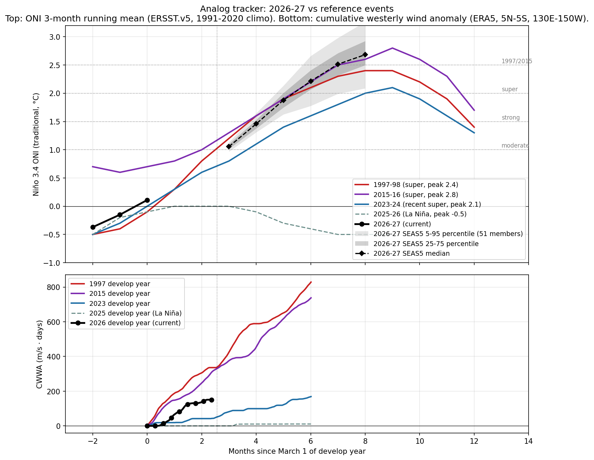

# El Niño Probability Tracker, week of 2026-05-18

Internal use.

Target peak season: **DJF 2026-27**. CPC's longest-lead strength bin is NDJ 2026-27, used as the proxy for the DJF peak.

## 1. Headline probabilities

Peak Niño 3.4 (traditional ONI), DJF 2026-27 / NDJ 2026-27.
Headline numbers below are CPC-derived after translating from RONI bins to traditional ONI thresholds, then fitting a skew-normal distribution to the nine bin probabilities and evaluating its survival function at each threshold. RONI-to-traditional-ONI offset is +0.50°C, the live tropical-mean SST anomaly observed for the week of 2026-05-06 (CPC). ECMWF SEAS5 member counts in caveat 2 are a second quantitative cross-check.

- **At least moderate (>+1.0°C peak)**: 98%
- **Strong (>+1.5°C peak)**: 91% (CPC anchor 89%, SEAS5 deflection +2.2 ppt)
- **Very strong / super (>+2.0°C peak)**: 74% (CPC anchor 67%, SEAS5 deflection +6.6 ppt)
- **1997/2015 magnitude (>+2.5°C peak)**: 45% (CPC anchor 37%, SEAS5 deflection +7.5 ppt)

Headline values use the v1.5 smoothed estimator: CPC anchor (monthly cadence) plus a bounded weekly deflection from the SEAS5 ensemble (weight 0.2, capped at ±10 ppt per bucket per week). The anchor and deflection are shown alongside the smoothed value where they differ. See methodology.html for the full rule.

**Source-by-source check (qualitative where strength bins aren't broken out):**

- NOAA CPC strength table, NDJ 2026-27 (RONI): super 37%, strong 30%, moderate 22%, weak El Niño 9%, neutral 2%, La Niña 0%. Issued 2026-05-14.
- IRI plume, DJF 2026-27: El Niño 90%, neutral 10%, La Niña 0%. Issued 2026-04-16. Strength not broken out in the public Quick Look.
- BoM ENSO Outlook, issued 2026-05-12: Tropical Pacific continues to warm as models suggest a transition to El Niño during winter. Categorical only.
- ECMWF SEAS5, run 2026-05-01: 51-member SEAS5 ensemble for 2026-11: median Niño 3.4 anomaly +2.68 deg C; 51/51 members above +1.5 (~100% above +2.0, ~75% above +2.5).

**Caveats this issue:**

1. The +2.5°C bucket carries a 36-38% range. It comes from a bootstrap that perturbs CPC's published bin probabilities by Gaussian noise (sigma 1 percentage point, matching CPC's whole-percent reporting precision) and refits the skew-normal each time. The range therefore reflects reporting-quantization uncertainty in CPC's table, not underlying forecast uncertainty.
2. ECMWF SEAS5 vs CPC, upper tail above +2.5°C trad ONI: SEAS5 has 38/51 members (75%) at 2026-11 (max available lead). CPC's NDJ 2026-27 bucket lands at 36-38%. We subtract SEAS5's own model climatology, which removes its known ENSO warm bias; an observational-climatology subtraction would put SEAS5 higher still. Real disagreement to surface, not a number to average.
3. Spring predictability barrier: April-May forecasts at any of these centers carry materially wider error bars than what we'll see in July-August. Treat all numbers as preliminary.

## 2. Physical state panel

| Indicator | Current (week of ~22 Apr 2026) | 1997 same week | 2015 same week |
|---|---|---|---|
| Niño 3.4 weekly (traditional) | +0.9°C | -0.1°C | +0.6°C |
| Niño 3.4 weekly (RONI) | +0.4°C | n/a (pre-RONI) | n/a (pre-RONI) |
| 0-300m heat content anomaly | +2.24°C (CPC monthly, 180W-100W, vs 1981-2010 climo) | +0.7°C | +1.6°C |
| Cumulative westerly wind anomaly since Mar 1 | 151 m/s·days (CWWA, ERA5 130E-150W, vs 1991-2020 climo) | 336 | 309 |

**Heat content note:** Above-average and rising. Qualitatively the warmest since Jun 2023; comparable to spring of 2015, well short of spring 1997. New downwelling Kelvin wave initiated in March 2026.

**CWWA note:** Live ERA5 daily 850 hPa zonal wind through 2026-05-12, area-meaned over 5N-5S, 130E-150W and integrated for positive (westerly) anomalies vs the 1991-2020 same-calendar-day climatology. At the same calendar date, 2026 CWWA (151) tracks closest to 2023 (43); other reference years: 1997 (336), 2015 (309), 2025 (0). Caveat: CWWA is a cumulative-area-mean metric and systematically understates transient localized westerly wind bursts, including those occurring just outside the 5N-5S band. A short intense burst can generate a downwelling Kelvin wave that does substantial physical work even when it barely moves the cumulative integral. For the operational read on whether ENSO development is on track, the surfacing-Kelvin-wave evidence in heat content (above) is at least as informative as this metric. See the WWB row below for the spatial-peak event count and analyst read (v1.7, complementary to CWWA).

**WWB events (spatial-peak detection, v1.7):** 5 westerly wind burst events detected since Mar 1, 2026. Detection: sliding 5x10 deg sub-region area-mean anomaly over 10N-10S, 130E-150W; dual threshold (5 m/s sustained for at least 5 days, peak day above 7 m/s) with peak-detection plus a 10-day recovery interval between events. Analogs (events to same calendar date): 1997 (6), 2015 (7), 2023 (6), 2025 (3).
  - 2026-03-01 to 2026-03-08, 8 days, peak 13.0 m/s, peak day 2026-03-02
  - 2026-03-09 to 2026-03-22, 14 days, peak 18.38 m/s, peak day 2026-03-14
  - 2026-03-23 to 2026-04-06, 15 days, peak 17.38 m/s, peak day 2026-03-31
  - 2026-04-07 to 2026-04-22, 16 days, peak 23.85 m/s, peak day 2026-04-12
  - 2026-05-01 to 2026-05-08, 8 days, peak 9.86 m/s, peak day 2026-05-02

**Analyst read on WWB row (v1.7).**

Peak amplitude is the primary signal in this row, not the count. 2026's strongest burst to date peaks at 23.9 m/s (peak day 2026-04-12). Full-season peaks for the analog years: 1997: 27.7 m/s, 2015: 29.5 m/s, 2023: 19.0 m/s, 2025: 12.7 m/s.

This lands in super-event territory: 2026's first burst is comparable in magnitude to 1997 and 2015 first bursts, well above what 2023 (sub-event El Niño) and 2025 (neutral / La Niña) produced. Peak amplitude is the strongest quantitative evidence to date that 2026's forcing is structurally aligned with the super-event analogs rather than the weaker recent analogs.

On count: 2026 has 5 events so far; analogs at the same calendar date: 1997 (6), 2015 (7), 2023 (6), 2025 (3). v1.7's peak-detection algorithm with a 10-day recovery interval splits sustained westerly periods into distinct bursts where v1.6 collapsed them. The count is now reasonably comparable across years, but peak amplitude remains the cleaner single number.

## 3. Analog tracker

Three reference El Niño events (1997-98, 2015-16, 2023-24) vs current 2026-27 trajectory in 3-month-running-mean ONI. Common reference is March 1 of develop year.

**Read this week:** at the JFM tick (month -1 since Mar 1), 2026 sits at -0.4°C, very close to where 1997 was (-0.4°C) and 2023 was (-0.3°C) at the same calendar point. Both went on to become super events. 2015 was already running ahead at +0.6°C in JFM. The takeaway is that JFM position is a weak discriminator; the ramp speed through MAM-AMJ is what matters, and we won't see that until the next 1-2 ONI updates.

Caveat: the analog plot uses 3-month running mean ONI. The current weekly Niño 3.4 (+0.5°C trad, week of Apr 15) is not directly plotted because it's not a 3-month mean. Adding a weekly trajectory to this chart is on the V1.5 list.

## 4. Impact outlook

Aggregation of institutional impact ranges for the developing event. Probabilities below are from named external sources, conditional on the headline strong-to-super case in section 1 materializing.

### Mediterranean

Spain, Portugal, Italy, Greece, southern France. Probability of severe summer 2026 heat and drought: high, >70% Iberia, ~65% Italy/Greece/southern France. The 2024 July Mediterranean heatwave was characterized by World Weather Attribution as "virtually impossible without human-caused climate change". A 2003-magnitude European heat event (~70,000 excess deaths) is rated medium probability (~25-30%) on a strong El Niño compounded with the multi-year Mediterranean drought baseline.

### Amazon basin

Probability of major drought 2026: high (>70%); probability of fire season exceeding 2024 hotspot levels: medium-high (~50%). NASA SERVIR characterized the 2023-24 drought magnitude as "roughly double" the 2015-16 event. The 2024 fire season produced a 76% increase in hotspots vs 2023.

### Australia and the Great Barrier Reef

Probability of severe bushfire season austral summer 2026-27: high (>65%); GBR mass bleaching: very high (>85%); agricultural drought: high (>70%). The reef has bleached six times since 2016; another super event makes a sixth-in-eight-years bleaching baseline. Australian winter wheat is the cleanest El Niño short on record, with declines of 16% to 46% under prior strong events (1965, 1977, 1982, 1994, 1997, 2023).

### Southern Africa

Probability of major drought repeat: ~70% if rains arrive late, per OCHA framing of the 2023-24 baseline ("worst impacts in 40 years"). Probability of a humanitarian appeal exceeding $5 billion: medium-high (~50%). Six SADC countries declared emergency in 2024; back-to-back is the asymmetric humanitarian risk.

### India and South Asia

IMD's April 2026 monsoon outlook is 92% of the long-period average, the first below-normal April call since 2015. Of 16 historical El Niño years since 1950, 7 produced below-normal Indian monsoons (IMD MMCFS). Pre-monsoon heat already reached 43.8°C at Akola in mid-April 2026.

### United States

California atmospheric river season: above-normal Pacific storm count winter 2026-27 high (~70%), with ~50% probability of a major atmospheric river damage event January-March 2027. Pacific Northwest: warmer-drier winter (~70%) with significant 2026 fire season (~50%). Atlantic hurricane season: high probability (~70%) of below-normal activity from El Niño wind shear, partially offset by warm Atlantic SSTs (2023 produced 20 named storms despite an El Niño base state). Southern Plains drought relief: low-medium (~25-30%); the 2023-24 super event underdelivered there.

### Southeast Asia

Significant drought in Indonesia: high (>70%); palm oil production decline: medium-high (~55%). The 2015-16 super event delivered a 13.2% Malaysian palm oil production decline at a 12-month lag. Vietnamese coffee output fell 20% in 2023-24.

### Global coral

The 2023-25 fourth global bleaching event already affects ~84% of world reefs (International Coral Reef Initiative, April 2025). Continued mass bleaching across all tropical basins is essentially certain into 2026-27.

## 5. Editorial layer

### What changed week-over-week

**New agency releases since last issue:**

- **cpc_strength**: prior issued 2026-04-09, now issued 2026-05-14.
    - NDJ neutral: 8% -> 2% (Delta -6)
    - NDJ 0.5to1.0: 15% -> 9% (Delta -6)
    - NDJ 1.0to1.5: 26% -> 22% (Delta -4)
    - NDJ 1.5to2.0: 26% -> 30% (Delta +4)
    - NDJ >=2.0: 25% -> 37% (Delta +12)

**Unchanged since last issue:** iri, ecmwf, bom.

**Physical state:** no numerical changes from last issue. (Either truly unchanged or weekly update has not been ingested.)

### Analyst read

> **AUTO-GENERATED:** the prose below is written by Claude from this week's diff and physical state. Review before quoting externally; edit freely if the analysis warrants it.

**(Fallback prose: API call failed. Falling back to mechanical summary of the diff. Replace before quoting.)**

This week's brief was generated without analyst commentary because the editorial generator could not reach the Anthropic API. The auto-diff above is the floor; please read it directly and add interpretation manually for any week where the deltas matter materially.

### Source freshness this issue

- **cpc_strength**: fetched live, issued 2026-05-14.
- **oisst_weekly**: fetched live, issued 2026-05-06.
- **heat_content**: fetched live, issued 2026-04-30.
- **iri**: live fetch failed; using last-good cache (issued 2026-04-20). Error: 3-category table not found on page.
- **bom**: fetched live, issued 2026-05-12.
- **ecmwf_seas5**: fetched live, issued 2026-05-01.
- **era5_wwe**: fetched live, issued 2026-05-12.
- **era5_burst**: fetched live, issued 2026-05-12.
- **oni_history**: fetched live, issued 2026-04-30.

---

*Generated by run_brief.py from sources.py + probs.py + analog.py. Methodology version 1.7. RONI offset +0.50°C (live, week of 2026-05-06). Next issue: Mon 4 May 2026 (per Monday cadence; first batch run is off-schedule).*
