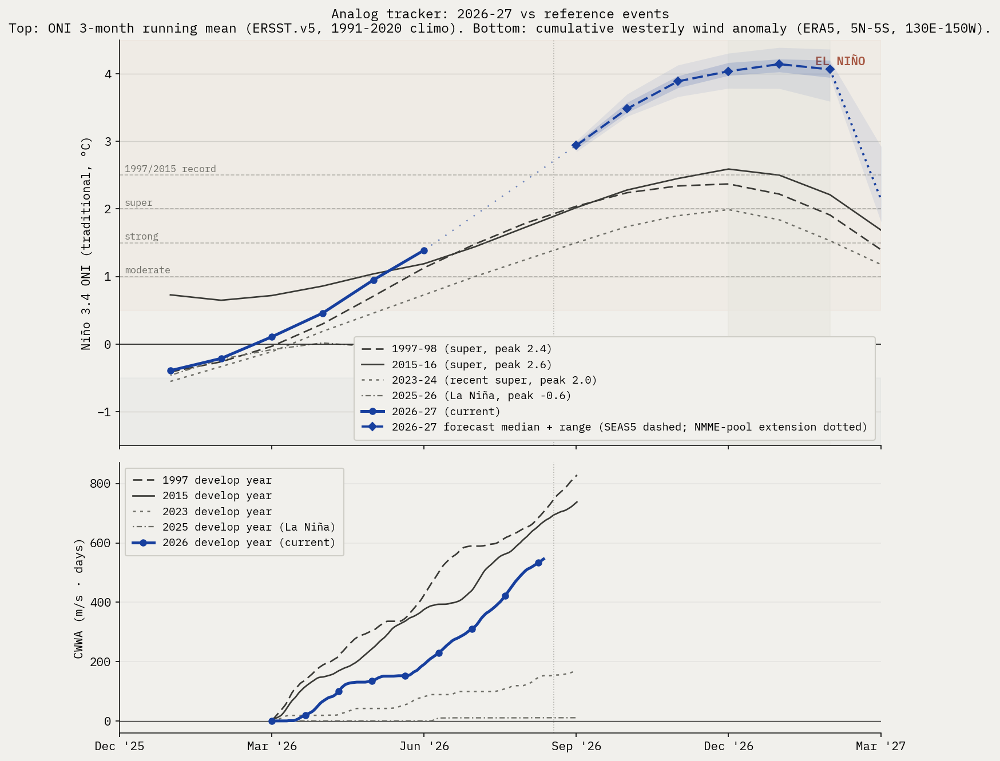

# El Niño Probability Tracker, week of 2026-08-17

Internal use.

Target peak season: **DJF 2026-27**. CPC's longest-lead strength bin is NDJ 2026-27, used as the proxy for the DJF peak.

## 1. Headline probabilities

Peak Niño 3.4 (traditional ONI), DJF 2026-27 / NDJ 2026-27.
Headline numbers below are CPC-derived after translating from RONI bins to traditional ONI thresholds, then fitting a skew-normal distribution to the nine bin probabilities and evaluating its survival function at each threshold. RONI-to-traditional-ONI offset is +0.90°C, the live tropical-mean SST anomaly observed for the week of 2026-08-12 (CPC). ECMWF SEAS5 member counts in caveat 2 are a second quantitative cross-check.

- **At least moderate (>+1.0°C peak)**: 99%
- **Strong (>+1.5°C peak)**: 99%
- **Very strong / super (>+2.0°C peak)**: 99%
- **1997/2015 magnitude (>+2.5°C peak)**: 99% (CPC anchor 98%, 6-model consensus 100%, deflection +1.7 ppt)
- **Beyond instrumental record (>+3.0°C peak)**: 94% (CPC anchor 86%, 6-model consensus 95%, deflection +7.6 ppt)
- **Far beyond record (>+3.5°C peak)**: 66% (CPC anchor 53%, 6-model consensus 68%, deflection +12.8 ppt)
- **Nothing to compare it to (>+4.0°C peak)**: 39% (CPC anchor 19%, 5-model consensus 43%, deflection +20.3 ppt)

Headline values use the v1.8 smoothed estimator: a CPC anchor (monthly cadence) plus a deflection toward an equal-weight multi-model consensus (ECMWF SEAS5 + the NMME suite). The consensus carries weight 0.85, so the headline is consensus-led with CPC as a minor anchor. This replaces the v1.5 SEAS5-only deflection (weight 0.2) and was adopted because a multi-model consensus past the spring predictability barrier, corroborated by subsurface heat and WWB peak amplitude, is more informative than CPC's lagging monthly table alone. The anchor and consensus are shown alongside the smoothed value. See methodology.html for the full rule and the rationale.

**Source-by-source check (qualitative where strength bins aren't broken out):**

- NOAA CPC strength table, NDJ 2026-27 (RONI): super 90%, strong 9%, moderate 1%, weak El Niño 0%, neutral 0%, La Niña 0%. Issued 2026-08-13.
- IRI plume, DJF 2026-27: El Niño 100%, neutral 0%, La Niña 0%. Issued 2026-07-20. Strength not broken out in the public Quick Look.
- BoM ENSO Outlook, issued 2026-08-11: Strong El Niño continues to intensify amid record-warm global sea-surface temperatures. Categorical only.
- ECMWF SEAS5, run 2026-08-01: 51-member SEAS5 ensemble for 2027-02: median Niño 3.4 anomaly +4.06 deg C; 51/51 members above +1.5 (~100% above +2.0, ~100% above +2.5).

**Caveats this issue:**

1. The +2.5°C bucket carries a 95-99% range. It comes from a bootstrap that perturbs CPC's published bin probabilities by Gaussian noise (sigma 1 percentage point, matching CPC's whole-percent reporting precision) and refits the skew-normal each time. The range therefore reflects reporting-quantization uncertainty in CPC's table, not underlying forecast uncertainty.
2. ECMWF SEAS5 vs CPC, upper tail above +2.5°C trad ONI: SEAS5 has 51/51 members (100%) at 2027-02 (max available lead). CPC's NDJ 2026-27 bucket lands at 95-99%. We subtract SEAS5's own model climatology, which removes its known ENSO warm bias; an observational-climatology subtraction would put SEAS5 higher still. Real disagreement to surface, not a number to average.
3. Forecast skill note: mid-year forecasts for the DJF peak are past the boreal-spring predictability barrier and carry materially narrower error bars than the April-May issuances did. The remaining uncertainty is concentrated in peak magnitude at the top of the distribution (the +3.0 and +3.5 buckets), not in whether a strong-to-super event occurs.
4. The +3.0°C and +3.5°C buckets are the most model-dependent numbers in the headline. +3.0°C exceeds every event in the instrumental record (1997 +2.37, 2015 +2.59), and it sits beyond CPC's published strength bins (which top out at >=2.0 RONI), so its CPC anchor (86%) is a deep skew-normal tail extrapolation. Under the consensus weighting the +3.0 bucket (94%) is driven mostly by direct model member counts, not that extrapolation. The +3.5°C bucket (66%, added 2026-07-06 once the July SEAS5 run pushed the top of the distribution past where +3.0 discriminates) is even more model-driven: its CPC anchor (53%) is effectively zero (that threshold is ~+3.0 RONI, far past CPC's top bin), so it is almost entirely direct model member counts above +3.5. Read it as 'where the hot models cluster,' not a calibrated probability, and note it leans hardest on the July ECMWF run.

## 2. Physical state panel

| Indicator | Current (week of 2026-08-12) | 1997 same week | 2015 same week |
|---|---|---|---|
| Niño 3.4 weekly (traditional) | +2.7°C | +1.7°C | +1.7°C |
| Niño 3.4 weekly (RONI) | +1.8°C | n/a (pre-RONI) | n/a (pre-RONI) |
| 0-300m heat content anomaly | +2.96°C (CPC monthly, 180W-100W, vs 1981-2010 climo) | +1.83°C | +1.69°C |
| Cumulative westerly wind anomaly since Mar 1 | 546 m/s·days (CWWA, ERA5 130E-150W, vs 1991-2020 climo) | 705 | 671 |

**Heat content note:** At +2.96°C, 2026 exceeds both 1997 (+1.83°C) and 2015 (+1.69°C) at the same calendar month, running ahead of either super-event analog at this stage of development.

**CWWA note:** Live ERA5 daily 850 hPa zonal wind through 2026-08-11, area-meaned over 5N-5S, 130E-150W and integrated for positive (westerly) anomalies vs the 1991-2020 same-calendar-day climatology. At the same calendar date, 2026 CWWA (546) tracks closest to 2015 (671); other reference years: 1997 (705), 2023 (152), 2025 (11). Caveat: CWWA is a cumulative-area-mean metric and systematically understates transient localized westerly wind bursts, including those occurring just outside the 5N-5S band. A short intense burst can generate a downwelling Kelvin wave that does substantial physical work even when it barely moves the cumulative integral. For the operational read on whether ENSO development is on track, the surfacing-Kelvin-wave evidence in heat content (above) is at least as informative as this metric. See the WWB row below for the spatial-peak event count and analyst read (v1.7, complementary to CWWA).

**WWB events (spatial-peak detection, v1.7):** 12 westerly wind burst events detected since Mar 1, 2026. Detection: sliding 5x10 deg sub-region area-mean anomaly over 10N-10S, 130E-150W; dual threshold (5 m/s sustained for at least 5 days, peak day above 7 m/s) with peak-detection plus a 10-day recovery interval between events. Analogs (events to same calendar date): 1997 (13), 2015 (14), 2023 (11), 2025 (5).
  - 2026-03-01 to 2026-03-08, 8 days, peak 13.0 m/s, peak day 2026-03-02
  - 2026-03-09 to 2026-03-22, 14 days, peak 18.37 m/s, peak day 2026-03-14
  - 2026-03-23 to 2026-04-06, 15 days, peak 17.38 m/s, peak day 2026-03-31
  - 2026-04-07 to 2026-04-22, 16 days, peak 23.85 m/s, peak day 2026-04-12
  - 2026-05-01 to 2026-05-08, 8 days, peak 9.86 m/s, peak day 2026-05-02
  - 2026-05-19 to 2026-06-04, 17 days, peak 15.26 m/s, peak day 2026-05-26
  - 2026-06-05 to 2026-06-18, 14 days, peak 14.82 m/s, peak day 2026-06-13
  - 2026-06-19 to 2026-06-30, 12 days, peak 15.84 m/s, peak day 2026-06-24
  - 2026-07-01 to 2026-07-12, 12 days, peak 18.69 m/s, peak day 2026-07-07
  - 2026-07-13 to 2026-07-24, 12 days, peak 17.36 m/s, peak day 2026-07-17
  - 2026-07-25 to 2026-08-05, 12 days, peak 20.85 m/s, peak day 2026-07-31
  - 2026-08-06 to 2026-08-11, 6 days, peak 12.88 m/s, peak day 2026-08-11

**Analyst read on WWB row (v1.7).**

Peak amplitude is the primary signal in this row, not the count. 2026's strongest burst to date peaks at 23.9 m/s (peak day 2026-04-12). Full-season peaks for the analog years: 1997: 27.7 m/s, 2015: 29.5 m/s, 2023: 19.0 m/s, 2025: 12.7 m/s.

This lands in super-event territory: 2026's first burst is comparable in magnitude to 1997 and 2015 first bursts, well above what 2023 (sub-event El Niño) and 2025 (neutral / La Niña) produced. Peak amplitude is the strongest quantitative evidence to date that 2026's forcing is structurally aligned with the super-event analogs rather than the weaker recent analogs.

On count: 2026 has 12 events so far; analogs at the same calendar date: 1997 (13), 2015 (14), 2023 (11), 2025 (5). v1.7's peak-detection algorithm with a 10-day recovery interval splits sustained westerly periods into distinct bursts where v1.6 collapsed them. The count is now reasonably comparable across years, but peak amplitude remains the cleaner single number.

## 2b. Multi-model consensus (NMME)

North American Multi-Model Ensemble, init 2026080800 (issued 2026-08-08). Peak Nino 3.4 over Nov 2026 - Feb 2027 (NDJ-DJF), region 5N-5S, 170W-120W. Each cell is the percent of that model's ensemble members whose peak exceeds the threshold. Anomalies are vs each model's own hindcast climatology (same convention as SEAS5).

| Model | Members | Peak (mean) | >+1.0 | >+1.5 | >+2.0 | >+2.5 | >+3.0 | >+3.5 | >+4.0 |
|---|---|---|---|---|---|---|---|---|---|
| NCEP CFSv2 | 32 | 4.24°C | 100% | 100% | 100% | 100% | 100% | 100% | 59% |
| CanESM5 | 20 | 3.41°C | 100% | 100% | 100% | 100% | 90% | 10% | 0% |
| GEM5.2-NEMO | 20 | 4.07°C | 100% | 100% | 100% | 100% | 100% | 100% | 55% |
| NCAR CCSM4 | 10 | 3.32°C | 100% | 100% | 100% | 100% | 80% | 0% | 0% |
| NCAR CESM1 | 10 | 4.74°C | 100% | 100% | 100% | 100% | 100% | 100% | 100% |
| **Consensus (equal model wt)** | 5 models | **3.96°C** | 100% | 100% | 100% | 100% | 94% | 62% | 43% |

**Consensus read:** The multi-model consensus puts 100% of members above +2.5°C (1997/2015 magnitude), and 94% above +3.0°C, which would exceed every event in the instrumental record (1997 +2.37, 2015 +2.59). These are directly-counted member fractions, not tail extrapolations. As of methodology v1.8 the NMME suite feeds the section-1 headline directly: the multi-model consensus deflection blends these models with ECMWF SEAS5 at weight 0.85. This panel shows the per-model breakdown behind that consensus, including the spread between the hot models (CFSv2, NCAR) and the cooler outliers (CanESM5).

**Panel caveats:**

- NMME updates monthly (around the 8th). This init (2026080800) predates the late-May model runs discussed publicly; the next init will capture those.
- Consensus is equal-weighted by model, so small-ensemble models (NCAR CCSM4/CESM1, 10 members each) carry the same weight as larger ones. Member-weighting lowers the upper-tail fractions by a few points. NCAR CESM1 is a known warm outlier.

## 3. Analog tracker

Three reference El Niño events (1997-98, 2015-16, 2023-24) vs current 2026-27 trajectory in 3-month-running-mean ONI. Common reference is March 1 of develop year.

**Read this week:** at the JFM tick (month -1 since Mar 1), 2026 sits at -0.4°C, very close to where 1997 was (-0.4°C) and 2023 was (-0.3°C) at the same calendar point. Both went on to become super events. 2015 was already running ahead at +0.6°C in JFM. The takeaway is that JFM position is a weak discriminator; the ramp speed through MAM-AMJ is what matters, and we won't see that until the next 1-2 ONI updates.

Caveat: the analog plot uses 3-month running mean ONI. The current weekly Niño 3.4 (+0.5°C trad, week of Apr 15) is not directly plotted because it's not a 3-month mean. Adding a weekly trajectory to this chart is on the V1.5 list.

## 4. Impact outlook

Aggregation of institutional impact ranges for the developing event. Probabilities below are from named external sources, conditional on the headline strong-to-super case in section 1 materializing.

### Mediterranean

Spain, Portugal, Italy, Greece, southern France. Probability of severe summer 2026 heat and drought: high, >70% Iberia, ~65% Italy/Greece/southern France. The 2024 July Mediterranean heatwave was characterized by World Weather Attribution as "virtually impossible without human-caused climate change". A 2003-magnitude European heat event (~70,000 excess deaths) is rated medium probability (~25-30%) on a strong El Niño compounded with the multi-year Mediterranean drought baseline.

### Amazon basin

Probability of major drought 2026: high (>70%); probability of fire season exceeding 2024 hotspot levels: medium-high (~50%). NASA SERVIR characterized the 2023-24 drought magnitude as "roughly double" the 2015-16 event. The 2024 fire season produced a 76% increase in hotspots vs 2023.

### Australia and the Great Barrier Reef

Probability of severe bushfire season austral summer 2026-27: high (>65%); GBR mass bleaching: very high (>85%); agricultural drought: high (>70%). The reef has bleached six times since 2016; another super event makes a sixth-in-eight-years bleaching baseline. Australian winter wheat is the cleanest El Niño short on record, with declines of 16% to 46% under prior strong events (1965, 1977, 1982, 1994, 1997, 2023).

### Southern Africa

Probability of major drought repeat: ~70% if rains arrive late, per OCHA framing of the 2023-24 baseline ("worst impacts in 40 years"). Probability of a humanitarian appeal exceeding $5 billion: medium-high (~50%). Six SADC countries declared emergency in 2024; back-to-back is the asymmetric humanitarian risk.

### India and South Asia

IMD's April 2026 monsoon outlook is 92% of the long-period average, the first below-normal April call since 2015. Of 16 historical El Niño years since 1950, 7 produced below-normal Indian monsoons (IMD MMCFS). Pre-monsoon heat already reached 43.8°C at Akola in mid-April 2026.

### United States

California atmospheric river season: above-normal Pacific storm count winter 2026-27 high (~70%), with ~50% probability of a major atmospheric river damage event January-March 2027. Pacific Northwest: warmer-drier winter (~70%) with significant 2026 fire season (~50%). Atlantic hurricane season: high probability (~70%) of below-normal activity from El Niño wind shear, partially offset by warm Atlantic SSTs (2023 produced 20 named storms despite an El Niño base state). Southern Plains drought relief: low-medium (~25-30%); the 2023-24 super event underdelivered there.

### Southeast Asia

Significant drought in Indonesia: high (>70%); palm oil production decline: medium-high (~55%). The 2015-16 super event delivered a 13.2% Malaysian palm oil production decline at a 12-month lag. Vietnamese coffee output fell 20% in 2023-24.

### Global coral

The 2023-25 fourth global bleaching event already affects ~84% of world reefs (International Coral Reef Initiative, April 2025). Continued mass bleaching across all tropical basins is essentially certain into 2026-27.

## 5. Editorial layer

### What changed week-over-week

**Methodology version bumped: 1.9 -> 1.11.** Check the methodology change log for whether headline-bucket comparability to last issue is affected; math changes break comparability, chart or prose changes do not.

**RONI->trad ONI offset changed: +0.8°C -> +0.9°C.** This shifts headline buckets even without underlying probability changes; flag in editorial.

**New agency releases since last issue:**

- **cpc_strength**: prior issued 2026-07-09, now issued 2026-08-13.
    - NDJ 1.0to1.5: 5% -> 1% (Delta -4)
    - NDJ 1.5to2.0: 20% -> 9% (Delta -11)
    - NDJ >=2.0: 75% -> 90% (Delta +15)
- **bom**: prior issued 2026-07-28, now issued 2026-08-11.

**Unchanged since last issue:** iri, ecmwf, nmme.

**Physical state deltas:**

- nino34_weekly_traditional: 2.6 -> 2.7 (delta +0.1)
- cwwa_ms_days: 519.21 -> 545.68 (delta +26.47)
- wwb_events_since_mar1: 11 -> 12 (delta +1)

**New WWB event since last issue (spatial-peak detection):**

- 2026-08-06 to 2026-08-11, 6 days, peak 12.88 m/s, peak day 2026-08-11

### Analyst read

> **AUTO-GENERATED:** the prose below is written by Claude from this week's diff and physical state. Review before quoting externally; edit freely if the analysis warrants it.

**(Fallback prose: API call failed. Falling back to mechanical summary of the diff. Replace before quoting.)**

This week's brief was generated without analyst commentary because the editorial generator could not reach the Anthropic API. The auto-diff above is the floor; please read it directly and add interpretation manually for any week where the deltas matter materially.

### Source freshness this issue

- **cpc_strength**: fetched live, issued 2026-08-13.
- **oisst_weekly**: fetched live, issued 2026-08-12.
- **heat_content**: fetched live, issued 2026-07-31.
- **iri**: fetched live, issued 2026-07-20.
- **bom**: fetched live, issued 2026-08-11.
- **ecmwf_seas5**: fetched live, issued 2026-08-01.
- **era5_wwe**: fetched live, issued 2026-08-11.
- **era5_burst**: fetched live, issued 2026-08-12.
- **oni_history**: fetched live, issued 2026-07-31.
- **nmme**: fetched live, issued 2026-08-08.

---

*Generated by run_brief.py from sources.py + probs.py + analog.py. Methodology version 1.11. RONI offset +0.90°C (live, week of 2026-08-12). Next issue: Mon 4 May 2026 (per Monday cadence; first batch run is off-schedule).*
